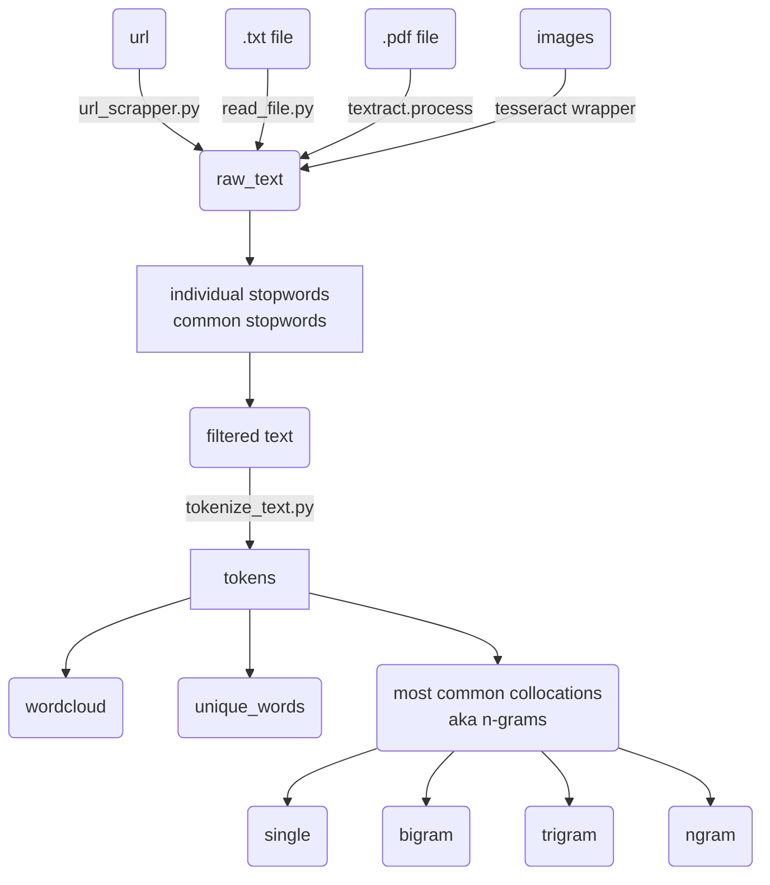

# nltk-process
the very things about processing text with nltk from top to down

## code graph

### how to into mermaid grapsh
 - https://github.blog/2022-02-14-include-diagrams-markdown-files-mermaid/
